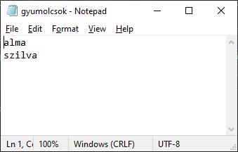

# Fájlkezelés

A program futása során sokszor adatokat állít elő, adatokat kér be, ezekkel számításokat végez. Gyakran van igény arra, hogy ezen adatokat valamilyen formában kiírjuk egy fájlban háttértárra (diszkre). Míg a memóriában tárolt adatok az alkalmazás újraindulása során elvesznek, a háttértáron levő adatok megmaradnak, még akkor is, ha a számítógép újraindul. Ezen felül a fájlok segítségével nagyon egyszerű módon tudnak alkalmazások egymással kommunikálni, adatot megosztani. Pl. az egyik alkalmazás kiírja az adatot egy fájlba, egy másik pedig beolvassa. Egy fájlra más szóval **állomány**ként és szokás hivatkozni (így a fájlkezelés ugyanazt jelenti, mint az állománykezelés.)

Minden fájlt egy útvonal azonosít, mely megmondja, mely meghajtón, annak milyen mappájában van a fájl. Pl.: c:\work\temp\gyumolcsok.txt.

A fájl tartalma, ha nagyon szigorúan nézzük, akkor bitek (igaz/hamis, 0/1) egymásutánja, mint minden a digitális világban. A számítógépek alcsony szinten csak a biteket értik, illetve a háttértárak is biteket tudnak nyersen tárolni.

Pl. egy fájl nyers tartalma lehet a következő bithalmaz:

```
01100001 01101100 01101101 01100001 00001101 00001010 01110011 01111010 01101001 01101100 01110110 01100001
```

Szukjuk a gondolatot, hogy **minden** fájl a dolgok legmélyén hasonlóképpen bitek sorozatából áll... A bitek a háttértáron gyakran folytatólagosan helyezkednek el, de mivel számunka ez teljesen átláthatatlan lenne, így 8 bitenként csoportosítva jelenítettük meg fent.
A gyakorlatban soha nem szoktunk fájlok tartalmával bitenként dolgozni. A biteket 8-as csoportokban dolgozzuk fel. 8 bit egy bájt. Egy bájt 0 és 255 között vehet fel értékeket. pl. a 00000000 bitsorozat bájtértéke 0, a 00000001-é 1, a 00000010-é 2, a 00000011-é 3, az 11111111-é pedig 255. A lényeg, hogy a fájlok tartalmára most már nem mint bitek, hanem fájlok sorozatára gondolunk. A fenti fájl példánk így néz ki bájtokkal reprezentálva (minden 8-as binárist átszámoltunk bájtra, ebben pédául a Windows-ban levő Számológép alkalmazás is segítségünkre lehet, csak át kell kapcsolni Programozó üzemmódra - érdemes kipróbálni):

```
97 108 109 97 13 10 115 122 105 108 118 97
```

Ez így más sokkal átláthatóbb. Mostantól úgy gondolunk minden fájlra, mint bájtok egymás után következő sorozatára. Pl. amikor egy kép fájról van szó, ezekbe a számokban a kép pixeljeinek színei vannak "belekódolva". Egy egyszerű szövegfájl esetén pedig ezek a számok a szöveg egyes karaktereit jelentik (erre még visszatérünk). Amikor valamilyen programozási nyelven fájlokat írunk és olvasunk nyersen, akkor bájtokat írunk ki és bájtokat olvasunk be. Pl. C# nyelven ki tudjuk írni egy bájl tömb tartalmát, vagy be tudunk olvasni fájlból részeket egy bájt tömbbe.

## Fájlkezelés általánosságában

Amikor valamilyen programozási nyelven fájlokkal dolgozunk, akkor lehetőségünk van:
* A fájl tartalmát olvasni.
* A fájl tartalmát írni (ez módosítja a tartalmat)
* Fájlt létrehozni, törölni, átnevezni, mozgatni, stb.

A fájl tartalmának olvasása/írása az alábbiaknak megfelelően történik:

1. Fájlt megnyitása
2. Tartalom olvasása vagy írása
    * C# kódból be tudunk olvasni adott poziciótól adott darabszámú bájtot (pl. mondhajuk, hogy a 10-edik bájttól kérünk 100-at), és az pl. egy bájt tömbbe kerül. Onnan tudjuk tovább alakítani számmá, sztringé, vagy ahogy értelmezni kívánjuk az adatokat. Arra vigyázni kell, hogy a fájl végén ne akarjunk túlolvasni (pl. ha 1000 bájlt van egy fájlban, ne akarjuk az 1001-ediket beolvasni.)
    * Adott pozíciótól ki tudunk írni adott darab bájtot (pl. mondhajuk, hogy a 10-edik bájttól kiírunk 100 általunk mehatározott bájtot). Amikor nem bájtot/bájt tömböt írunk ki, fájlba, hanem pl. számot, sztringet, vagy más típust, azt is először bájtokká kell alakítani a fájlba írás előtt (szerencsére a .NET számunkra ezt sokszor elrejti).
3. Fájl lezárása. Ez is fontos, mert ha elmarad, akkor lehet ki sem íródnak a módosítások, vagy a fájl zárolva lesz, így nem tudjuk más alkalmazásokból megnyitni, módosítani, törölni (ez attól függ, hogy nyitottuk meg a fájlt).

Kód és példa. Az alacsonyabb, bájtszintű fájlkezelésre ritkábban van szükség, így erre nem nézünk példákat. De itt van egyébként egy példa, az látszódik, hogy a File osztállyal nyitja meg a fájlt, és után byte tömbe teszi az adatot, és ezt írja ki a FileStream.Write műveletével (adott pozíciótól), az olvasás is bájtokkal dolgozik: https://docs.microsoft.com/en-us/dotnet/api/system.io.file.openwrite?view=netcore-3.1#examples  

## Szövegfájlok

A szövegfájlok is fájlok, csak éppen a tartalmuk szöveg, így pl. az egyszerű Jegyzettömb (Notepad) alkalmazással is meg lehet értelmesen jeleníteni a tartalmukat. Lényeges, hogy nem a fájl kiterjesztésétől lesz a fájl szöveges, hanem a tartalmától, bámilyen kiterjesztésű fájlba lehet szöveges tartalmat kiírni (de természetesen logikus ilyen esetben a .txt kiterjesztés használata, vagy pl. a csv, ha valamilyen szepatárorral elválasztott struktrált szöveges tartalom van a fájlban).
A szövegfájlban is bájtok vannak, csak ezek a bájtok szövegbeli karaktereket jelentenek. A klasszikus ASCII kódolású szövegfájlok esetén minden bájt pontosan egy karaktert jelent.

Nézzük a fenti példánkat, amikor a fájl tartalma a következő:

```
97 108 109 97 13 10 115 122 105 108 118 97
```

Próbáljuk ezt most szövegfájltként értelmezni, ennekmegfelelően egy ASCII táblázatban nézzük meg minden egyes bájtra, milyen karakter tartozik hozzá (pl. itt https://hu.wikipedia.org/wiki/ASCII):

```
a l m a CR LF s z i v l a
```


Vagyis egy CR+LF-vel elválasztott "alma" és "szilva". Egyben, ha mint C# string nézzük "alma\r\nszilva".  Ez bizony szöveges tartalom, vagyis egy szövegfájllal van dolgunk. Ha megnyitjuk a Jegyzettömb (Notepad) alkalmazásban, így néz ki:



 A tisztázandó még, hogy mik a 10 (CR) és 13 (LF) bájt a közepén. Egyszerűen arról van szó, hogy van egy sortörés is az alma után, amit Windows operációs rendszerben két speciális karakter jelöl. C#-ban '\r' és egy '\n' karakter, egy stringbe írva "\r\n". A '\r' számértéke 13, a '\n'-né 10.

Megjegyzés: Linux operációs rendszer alatt csak egy karakter használatos, a '\n'.

Megjegyzés: A '\n' és a '\n', bár C# nyelven a forráskódban két karakterrel jelöljük, csak egy bájt hosszú  mindkettő: a C# nyelven a \ egy escape szekvencia kezdetét jelöli, vagyis pl. a '\n' nem egy '\' és egy 'n' karakter egymásután, hanem a '\n' önmagában jelöl **egyetlen** speciális karaktert, melynek a számkódja 13.

A szövegfájlok írására/olvasására egyszerűbb lehetőségünk is van, mint bájtokkal, bájtömbökkel dolkgozni. Egyszerű **sztringekkel** dolgozunk.

### Szövegfájl írása

Szövegfájlba írni a `StreamWriter` osztály `Write`, illetve `WriteLine` műveletével tudunk: a `Write` egyszerűen kiírja a fájl végére a paraméterként kapott stringet. A `WriteLine` is kiírja a paraméterként kapott stringet, de a végére még egy sortörést is hozzáfűz ("\r\n"), így a későbbi írás már egy új sorba történik majd (ha még írunk a fájlba).

Példa a fenti, két gyümölcsöt tartalmazó fájl írására:

``` csharp
string fajlUtvonal = @"c:\temp\gyumolcsok.txt"; // #1
StreamWriter writer = new StreamWriter(fajlUtvonal, false); // #2
writer.WriteLine("alma"); // #3
writer.WriteLine("szilva"); // #4
writer.Close(); // #5
```

* \#1 - Útvonal a fájlhoz. A c:\temp mappának léteznie kell! Lényges, hogy @ karakterrel kezdjük az útvonalat, különben a \\-t escape karakter kedetének veszi, és nem \\ karakternek (vagy ha nem használjuk a @-ot, duplázzuk meg mindenhol a \-t, így: \\\\)
* \#2 - A `StreamWriter` egy .NET beépített osztály. Amikor létrehozunk belőle egy példányt, megnyitja a fájlt.
    * Az első paraméter (fajlnev) adja meg a fájl nevét, ebbe írunk majd.
    * A második paraméter egy bool. Ha false-t adunk meg, akkor amennyiben létezik már ilyen fájl, ezt törli és az elejétől kezdve írunk bele. Ha true (ez ún. append, hozzáfűzés mód), akkor a már létező file tartalma megmarad, és amit mi beleírunk, az a végéhez fűződik hozzá.
    * Megjegyzés: ha akartunk volna, megadhattuk volna egy harmadik paraméterben, hogy milyen karakterkódolással írjuk a fájlt.
* \#3 - Kiírja az "alma" szöveget és egy sortörést a `writer` objektum által kezelt fájl végére ("\r\n"). Ha azt szerettük volna, hogy a rákövetkező sorban a "szilva" is az "alma" sorában jelenjen meg, akkor a `WriteLine` helyett a `Write` műveletet használtuk volna.
* \#4 - Kiírja a "szilva" szöveget, és ennek a végére is tesz sortörést. Így most nem is az eredeti feladatunknak megfelelő fájlt kapjuk, abban nem volt a szilva után sortörés! Ha ez valakit zavar, a `WriteLine` helyett a `Write`-ot kell használni.
* \#5 - Fájl lezárása. Ez is fontos, mert ha elmarad, akkor lehet ki sem íródnak a módosítások, vagy a fájl zárolva lesz, így nem tudjuk más alkalmazásokból megnyitni, módosítani, törölni (ez attól függ, hogy nyitottuk meg a fájlt).

Ha nem stringet, hanem pl. számot szeretnénk kiírni, akkor azt előbb stringgé kell alakítani (pl. ToString() hívással). Vagy használhatjuk a `Write` és `WriteLine` kicsit haladóbb változatát:

``` csharp
string fajlUtvonal = @"c:\temp\adatok.txt";
StreamWriter writer = new StreamWriter(fajlnev, false);
// A {0} helyére behelyettesíti a nulladik paramétert, vagyis a 3.14-et
// A {1} helyére pedig az első paramétert, vagyis a 8.2-5, és így írja ki.
writer.WriteLine("Pi: {0}, Terület: {1}", 3.14, 8.2);
writer.Close();
```

#### Teljes szövegfájl írása egyben

Alternatív lehetőség fájl írására. Ha nem darabokból akarjuk összerakni (pl. soronként) a fájlt és nem csak hozzáfűzni akarunk, hanem úgy ahogy van, a teljes tartalmat kiírni, erre is van nagyon egyszerű lehetőség:

``` csharp
string fajlUtvonal = @"c:\temp\adatok.txt";
string szoveg = "alma\r\nszilva";
File.WriteAllText(fajlUtvonal, szoveg);
```

A beépített File osztály statikus `WriteAllText` műveletét használjuk. Mivel ez statikus, a File-ból nem kell a new-val objektumot létrehozni. Csak megadjuk az útvonalat a fájlhoz és a stringet, aminek a tartalmát egy az egyben kiírja a fájlba. Ha akarunk, megadhatunk egy harmadik paramétert is (karakterkódolás).

### Szövegfájl olvasása

 Szövegfájlból olvasni írni a `StreamReader` osztály `Read`, illetve `ReadLine` műveletével tudunk: a Read egyetlen karaktert olvas be az aktuális fájlpozíciótól, a ReadLine pedig az aktuális sort olvassa be egy stringbe (vagyis addig olvas az aktuális fájl pozíciótól, míg "\r\n"-t nem talál, vagy el nem ér a fájl végéig).

Példa a fenti, két gyümölcsöt tartalmazó fájl soronként történő beolvasására:

``` csharp
string fajlUtvonal = @"c:\temp\gyumolcsok.txt"; // #1
StreamReader reader = new StreamReader(fajlUtvonal); // #2
string gyumolcs1 = reader.ReadLine(); // #3
string gyumolcs2 = reader.ReadLine(); // #4
writer.Close(); // #5
```

* \#1 - Útvonal a fájlhoz. A c:\temp mappának léteznie kell! Lényges, hogy @ karakterrel kezdjük az útvonalat, különben a \\-t escape karakter kedetének veszi, és nem \\ karakternek (vagy ha nem használjuk a @-ot, duplázzuk meg mindenhol a \-t, így: \\\\)
* \#2 - A `StreamReader` egy .NET beépített osztály. Amikor létrehozunk belőle egy példányt, megnyitja a fájlt.
* \#3 - Beolvassa következő sort és visszatér vele, elmentjük egy stringben.
* \#4 - Beolvassa következő sort és visszatér vele, elmentjük egy stringben.
* \#5 - Fájl lezárása. Ez is fontos, mert ha elmarad, akkor lehet ki sem íródnak a módosítások, vagy a fájl zárolva lesz, így nem tudjuk más alkalmazásokból megnyitni, módosítani, törölni (ez attól függ, hogy nyitottuk meg a fájlt).

Általában nem tudjuk, hány sorból áll egy fájl, ezért while ciklusban olvassuk a sorokat mindaddig, amíg el nem érünk a fájl végére:

``` csharp
string fajlUtvonal = @"c:\temp\gyumolcsok.txt";
StreamReader reader = new StreamReader(fajlUtvonal);
// Ebben tároljuk majd az aktuális sort
string sor;
// Beolvassuk a következő sort a sor változóba.
// Ha elértük a fájl végét, a ReadLine() null-lal tér vissza, a sor is null lesz
// így kilépünk a ciklusból.
while ((sor = sr.ReadLine()) != null)
{
    // A line-ban ott az aktuális sor. Itt csak kiírjuk a konzolra.
    Console.WriteLine(line);
}
writer.Close();  // Ne felejtsd el lezárni!
```

A példa magyarázatát a kódba fűzött megjegyzésekben látod. A ciklus beljesében gyakran nem csak kiírjuk a konzolra az aktuális sort, hanem fel is dolgozzuk azt. Pl., ha valamilyen szeparátottal elválasztott "elemek" vannak benne, akkor a string.Splittel szét tudjuk vágni: itt string tömböt kapunk, ebből már megfelelő konverziókkal ki tudjuk nyerni a tartalmat. Pl.

``` csharp
string[] elemek = sor.Split("\t");  // tab mentén vágunk
string nev = elemek[0];
string kor = Convert.ToInt32(elemek[1]);
...
```

Megjegyzés: így is lehet while ciklusban soronént felolvasni a fájlt, ugyanaz a lényege, mint a fentinek, csak másként detektálja a fájl végét:

``` csharp
while (!r.EndOfStream)
{
  string s = r.ReadLine();
  ...
}
```

#### Teljes szövegfájl olvasása egyben

 Alternatív lehetőség fájl olvasására. Szövegfájlt lehetőségünk van egyben (és nem soronként), egyetlen stringbe beolvasni:

``` csharp
string fajlUtvonal = @"c:\temp\adatok.txt";
string szoveg = File.ReadAllText(fajlUtvonal);
```

Ezzel csak óvatosan, ritkábban dolgozunk így: ha nagy a fájl, lehet nem fér ez a teljes tartalom a memóriába (hiszen itt nagyméretű, akár több gigabájtos fájlt is beolvashatunk), és ekkor csúnya hibát fogunk kapni!

A szoveg sztringben megkapjuk a fájl teljes szöveges tartalmát egyben. Ha sortörések voltak a fájlban, azok a stringben "\r\n"-ek lesznek!
Feladat: hogyan tudjuk ezt a stringet sortörések mentén vágni, és egy string tömbben a sorokat megkapni? (a válasz szoveg.Split("\r\n)).

Itt találsz jó magyarázatot és példákat szövegfájl írására és olvasására is: http://aries.ektf.hu/~hz/wiki7/mprog1ea/text_file

## További lényeges információk

TODO (Van még? - igen, a biztos fájl lezárás, using blokk)

## Feladat

Írj egy függvényt, mely egy szöveges fájl tartalmát átmásolja egy másik fájlba. Két paramétere van: útvonal a forrásfájlhoz, illetve útvonal a célfájlhoz.

Két változatát és készítsd el.

* Az első, egyszerű megoldásban a File.ReadAllText és File.WriteAllText-et használhatod.
* A második megoldás legyen takarékos a memóriával, működjön akkor is, ha óriási fájl kell másolni. Azt felteheted, hogy a fájl sok sorból áll (vagyis soronként célszerű a fájlt másolni).